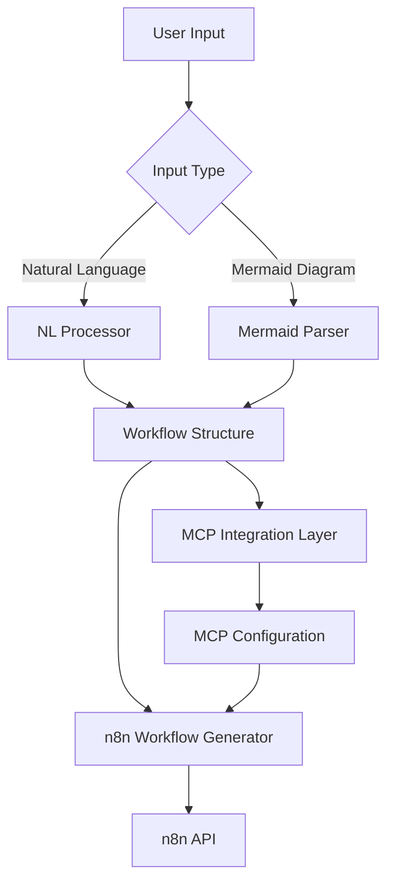

# n8n Workflow Chat Agent

This project creates a chat-based agent for n8n that can generate workflows and AI agents with MCPs based on natural language instructions or mermaid diagrams.

## Architecture

The system consists of several key components:

1. **Chat Interface**: Handles user interactions
2. **Natural Language Processor**: Interprets user instructions
3. **Mermaid Parser**: Converts mermaid diagrams to structured workflow definitions
4. **n8n Workflow Generator**: Creates n8n workflows programmatically
5. **MCP Integration Layer**: Connects to and configures MCPs for advanced AI capabilities

## How It Works



## Setup Instructions

1. Clone this repository
2. Install dependencies with `npm install`
3. Configure your n8n instance in `.env`
4. Start the agent with `npm start`

## Usage Examples

### Creating a Simple Workflow via Natural Language

```
Create a workflow that fetches new tweets mentioning #n8n and sends them to a Slack channel
```

### Creating an Advanced AI Agent via Mermaid

```
graph TD
    A[HTTP Trigger] --> B[Claude AI]
    B --> C{Decision}
    C -->|Research Needed| D[Brave Search]
    C -->|Code Needed| E[GitHub MCP]
    D --> F[Response Formatter]
    E --> F
    F --> G[HTTP Response]
```

## MCP Integration

This agent can integrate with various MCP servers to enhance workflow capabilities:

- **Search MCPs**: For information retrieval
- **Code MCPs**: For generating and executing code
- **Analysis MCPs**: For processing and analyzing data
- **Custom MCPs**: For specialized domain tasks

## Contributing

Contributions are welcome! Please see [CONTRIBUTING.md](CONTRIBUTING.md) for guidelines.

## License

MIT
