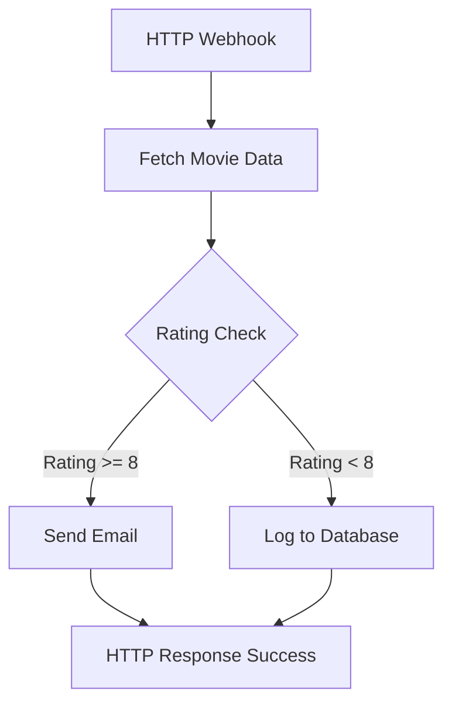

# Chat to Workflow Examples

This document showcases examples of how the n8n Workflow Chat Agent can be used to create workflows from natural language instructions or mermaid diagrams.

## Example 1: Creating a Workflow with Natural Language

### User Input
```
Create a workflow that monitors a GitHub repository for new issues, analyzes the sentiment of each issue using AI, and sends a Slack notification if the sentiment is negative.
```

### Chat Agent Response
```
I've created a workflow based on your instructions. The workflow will:

1. Monitor a GitHub repository for new issues using a webhook trigger
2. Analyze the sentiment of each issue using an AI node
3. Use an If node to check if the sentiment is negative
4. Send a Slack notification for negative sentiment issues

The workflow has been generated and can be deployed to your n8n instance. Would you like to make any adjustments before deployment?
```

### Generated Workflow
```json
{
  "name": "GitHub Issue Sentiment Analysis",
  "nodes": [
    {
      "id": "1",
      "name": "GitHub Trigger",
      "type": "n8n-nodes-base.githubTrigger",
      "parameters": {
        "owner": "{{$env.GITHUB_OWNER}}",
        "repository": "{{$env.GITHUB_REPO}}",
        "events": ["issues"],
        "authentication": "oAuth2"
      },
      "position": [0, 0]
    },
    {
      "id": "2",
      "name": "Sentiment Analysis",
      "type": "n8n-nodes-base.openai",
      "parameters": {
        "model": "gpt-4",
        "prompt": "Analyze the sentiment of the following GitHub issue. Return only one word: 'positive', 'neutral', or 'negative'.\n\nTitle: {{$node[\"GitHub Trigger\"].json[\"issue\"][\"title\"]}}\n\nBody: {{$node[\"GitHub Trigger\"].json[\"issue\"][\"body\"]}}",
        "output": "text"
      },
      "position": [220, 0]
    },
    {
      "id": "3",
      "name": "Check Sentiment",
      "type": "n8n-nodes-base.if",
      "parameters": {
        "conditions": {
          "string": [
            {
              "value1": "{{$node[\"Sentiment Analysis\"].json[\"text\"].trim().toLowerCase()}}",
              "operation": "contains",
              "value2": "negative"
            }
          ]
        }
      },
      "position": [440, 0]
    },
    {
      "id": "4",
      "name": "Send Slack Alert",
      "type": "n8n-nodes-base.slack",
      "parameters": {
        "channel": "github-alerts",
        "text": "⚠️ Negative sentiment detected in GitHub issue!\n\nRepo: {{$node[\"GitHub Trigger\"].json[\"repository\"][\"full_name\"]}}\nIssue #{{$node[\"GitHub Trigger\"].json[\"issue\"][\"number\"]}}: {{$node[\"GitHub Trigger\"].json[\"issue\"][\"title\"]}}\nURL: {{$node[\"GitHub Trigger\"].json[\"issue\"][\"html_url\"]}}"
      },
      "position": [660, -100]
    }
  ],
  "connections": {
    "1": {
      "main": [
        {
          "node": "2",
          "type": "main",
          "index": 0
        }
      ]
    },
    "2": {
      "main": [
        {
          "node": "3",
          "type": "main",
          "index": 0
        }
      ]
    },
    "3": {
      "true": [
        {
          "node": "4",
          "type": "main",
          "index": 0
        }
      ]
    }
  }
}
```

## Example 2: Creating a Workflow with Mermaid Diagram

### User Input


### Chat Agent Response
```
I've created a workflow based on your diagram. The workflow will:

1. Start with an HTTP Webhook trigger
2. Fetch movie data (I've set this up as an HTTP Request node)
3. Check the movie rating
4. Send an email for highly rated movies (rating >= 8)
5. Log to a database for lower rated movies
6. Return an HTTP response

The workflow has been generated and can be deployed to your n8n instance. Would you like to make any adjustments before deployment?
```

### Generated Workflow
```json
{
  "name": "Movie Rating Workflow",
  "nodes": [
    {
      "id": "A",
      "name": "HTTP Webhook",
      "type": "n8n-nodes-base.webhooktrigger",
      "parameters": {
        "path": "movie-webhook",
        "respondWith": "json",
        "options": {}
      },
      "position": [250, 100]
    },
    {
      "id": "B",
      "name": "Fetch Movie Data",
      "type": "n8n-nodes-base.httprequest",
      "parameters": {
        "url": "=https://api.themoviedb.org/3/movie/{{$json.movieId}}",
        "authentication": "genericCredentialType",
        "genericAuthType": "httpQueryAuth",
        "options": {}
      },
      "position": [250, 250]
    },
    {
      "id": "C",
      "name": "Rating Check",
      "type": "n8n-nodes-base.if",
      "parameters": {
        "conditions": {
          "number": [
            {
              "value1": "={{$json.vote_average}}",
              "operation": "greaterEqual",
              "value2": 8
            }
          ]
        }
      },
      "position": [250, 400]
    },
    {
      "id": "D",
      "name": "Send Email",
      "type": "n8n-nodes-base.emailsend",
      "parameters": {
        "to": "={{$env.NOTIFICATION_EMAIL}}",
        "subject": "=Highly Rated Movie: {{$json.title}}",
        "text": "=A highly rated movie was found!\n\nTitle: {{$json.title}}\nRating: {{$json.vote_average}}/10\nOverview: {{$json.overview}}"
      },
      "position": [100, 550]
    },
    {
      "id": "E",
      "name": "Log to Database",
      "type": "n8n-nodes-base.postgres",
      "parameters": {
        "operation": "insert",
        "table": "movie_logs",
        "columns": "title,rating,overview,timestamp",
        "values": "={{$json.title}},{{$json.vote_average}},{{$json.overview}},{{$now.toISOString()}}"
      },
      "position": [400, 550]
    },
    {
      "id": "F",
      "name": "HTTP Response Success",
      "type": "n8n-nodes-base.respondToWebhook",
      "parameters": {
        "options": {},
        "respondWith": "json",
        "responseBody": "={ \"success\": true, \"message\": \"Movie processed\" }"
      },
      "position": [250, 700]
    }
  ],
  "connections": {
    "A": {
      "main": [
        {
          "node": "B",
          "type": "main",
          "index": 0
        }
      ]
    },
    "B": {
      "main": [
        {
          "node": "C",
          "type": "main",
          "index": 0
        }
      ]
    },
    "C": {
      "true": [
        {
          "node": "D",
          "type": "main",
          "index": 0
        }
      ],
      "false": [
        {
          "node": "E",
          "type": "main",
          "index": 0
        }
      ]
    },
    "D": {
      "main": [
        {
          "node": "F",
          "type": "main",
          "index": 0
        }
      ]
    },
    "E": {
      "main": [
        {
          "node": "F",
          "type": "main",
          "index": 0
        }
      ]
    }
  }
}
```

## Example 3: Creating an Advanced AI Agent with MCPs

### User Input
```
Create an AI research agent that can search the web, analyze data, and generate reports. It should be triggered via webhook and have a chat-like interface.
```

### Chat Agent Response
```
I've created an advanced AI agent workflow based on your instructions. This agent leverages multiple MCPs for enhanced capabilities:

1. HTTP Webhook entry point for chat-like interactions
2. Claude AI as the main agent for orchestrating the workflow
3. Brave Search MCP for retrieving information from the web
4. Data Analysis MCP for processing structured data
5. GitHub MCP for generating and storing code snippets when needed
6. HTTP Response to provide results back to the user

The workflow has been configured with proper error handling and authentication. Would you like to deploy it to your n8n instance?
```

### Generated Workflow with MCPs
```json
{
  "name": "AI Research Agent",
  "nodes": [
    {
      "id": "webhook",
      "name": "Chat Interface",
      "type": "n8n-nodes-base.webhooktrigger",
      "parameters": {
        "path": "ai-research-agent",
        "options": {
          "responseMode": "lastNode"
        }
      },
      "position": [250, 100]
    },
    {
      "id": "claude",
      "name": "Claude AI Orchestrator",
      "type": "n8n-nodes-base.openai",
      "parameters": {
        "model": "claude-3-opus",
        "prompt": "You are an AI research assistant. Analyze the user's request and determine what tools you need.\n\nUser query: {{$json.query}}\n\nRespond with a JSON object with these fields:\n- needs_search: Boolean, whether web search is needed\n- search_query: String, what to search for if needed\n- needs_analysis: Boolean, whether data analysis is needed\n- analysis_type: String, type of analysis if needed\n- needs_code: Boolean, whether code generation is needed\n- code_description: String, what code to generate if needed\n- direct_response: String, a direct response if no tools are needed"
      },
      "position": [450, 100],
      "mcp": {
        "id": "openai-mcp",
        "type": "llm",
        "url": "http://localhost:3002"
      }
    },
    {
      "id": "router",
      "name": "Tool Router",
      "type": "n8n-nodes-base.switch",
      "parameters": {
        "rules": {
          "conditions": [
            {
              "value1": "={{$json.needs_search}}",
              "operation": "equals",
              "value2": true
            },
            {
              "value1": "={{$json.needs_analysis}}",
              "operation": "equals",
              "value2": true
            },
            {
              "value1": "={{$json.needs_code}}",
              "operation": "equals",
              "value2": true
            }
          ]
        }
      },
      "position": [650, 100]
    },
    {
      "id": "braveSearch",
      "name": "Web Search",
      "type": "custom.bravesearch",
      "parameters": {
        "query": "={{$json.search_query}}",
        "maxResults": 5
      },
      "position": [850, 0],
      "mcp": {
        "id": "brave-search-mcp",
        "type": "search",
        "url": "http://localhost:3003"
      }
    },
    {
      "id": "dataAnalysis",
      "name": "Data Analysis",
      "type": "n8n-nodes-base.function",
      "parameters": {
        "functionCode": "// This node will be enriched by the Data Analysis MCP\nreturn items;"
      },
      "position": [850, 100],
      "mcp": {
        "id": "data-analysis-mcp",
        "type": "analysis",
        "url": "http://localhost:3004"
      }
    },
    {
      "id": "codeGenerator",
      "name": "Code Generator",
      "type": "custom.github",
      "parameters": {
        "operation": "generateCode",
        "description": "={{$json.code_description}}"
      },
      "position": [850, 200],
      "mcp": {
        "id": "github-mcp",
        "type": "code",
        "url": "http://localhost:3005"
      }
    },
    {
      "id": "aggregator",
      "name": "Aggregate Results",
      "type": "n8n-nodes-base.merge",
      "parameters": {},
      "position": [1050, 100]
    },
    {
      "id": "responseFormatter",
      "name": "Format Response",
      "type": "n8n-nodes-base.function",
      "parameters": {
        "functionCode": "// Format all gathered information into a coherent response\nconst data = {\n  query: items[0].json.query,\n  searchResults: items[0].json.searchResults || [],\n  analysisResults: items[0].json.analysisResults || {},\n  generatedCode: items[0].json.generatedCode || '',\n  directResponse: items[0].json.direct_response || ''\n};\n\n// Generate a well-formatted response\nlet response;\n\nif (data.directResponse) {\n  response = data.directResponse;\n} else {\n  response = `# Research Results\\n\\n`;\n  \n  if (data.searchResults.length > 0) {\n    response += `## Web Search Results\\n\\n`;\n    data.searchResults.forEach((result, i) => {\n      response += `${i+1}. **${result.title}**\\n   ${result.description}\\n   [Source](${result.url})\\n\\n`;\n    });\n  }\n  \n  if (Object.keys(data.analysisResults).length > 0) {\n    response += `## Analysis Results\\n\\n`;\n    response += `${JSON.stringify(data.analysisResults, null, 2)}\\n\\n`;\n  }\n  \n  if (data.generatedCode) {\n    response += `## Generated Code\\n\\n\\`\\`\\`\\n${data.generatedCode}\\n\\`\\`\\`\\n\\n`;\n  }\n}\n\nreturn [{\n  json: {\n    response\n  }\n}];"
      },
      "position": [1250, 100]
    },
    {
      "id": "httpResponse",
      "name": "HTTP Response",
      "type": "n8n-nodes-base.respondToWebhook",
      "parameters": {
        "options": {},
        "responseBody": "={{$json.response}}"
      },
      "position": [1450, 100]
    }
  ],
  "connections": {
    "webhook": {
      "main": [
        {
          "node": "claude",
          "type": "main",
          "index": 0
        }
      ]
    },
    "claude": {
      "main": [
        {
          "node": "router",
          "type": "main",
          "index": 0
        }
      ]
    },
    "router": {
      "0": [
        {
          "node": "braveSearch",
          "type": "main",
          "index": 0
        }
      ],
      "1": [
        {
          "node": "dataAnalysis",
          "type": "main",
          "index": 0
        }
      ],
      "2": [
        {
          "node": "codeGenerator",
          "type": "main",
          "index": 0
        }
      ]
    },
    "braveSearch": {
      "main": [
        {
          "node": "aggregator",
          "type": "main",
          "index": 0
        }
      ]
    },
    "dataAnalysis": {
      "main": [
        {
          "node": "aggregator",
          "type": "main",
          "index": 1
        }
      ]
    },
    "codeGenerator": {
      "main": [
        {
          "node": "aggregator",
          "type": "main",
          "index": 2
        }
      ]
    },
    "aggregator": {
      "main": [
        {
          "node": "responseFormatter",
          "type": "main",
          "index": 0
        }
      ]
    },
    "responseFormatter": {
      "main": [
        {
          "node": "httpResponse",
          "type": "main",
          "index": 0
        }
      ]
    }
  }
}
```
